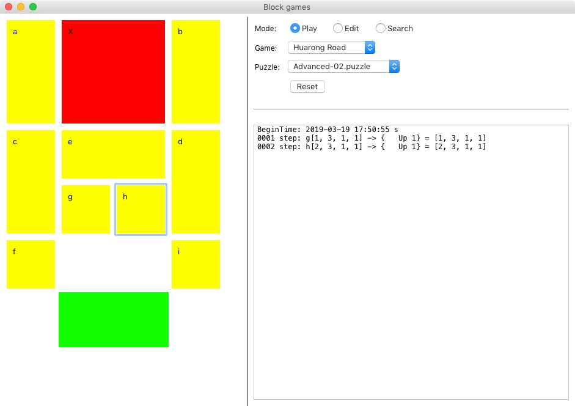
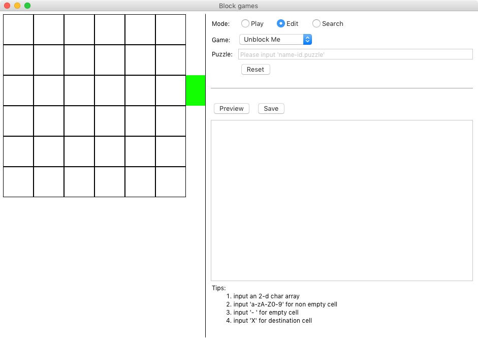
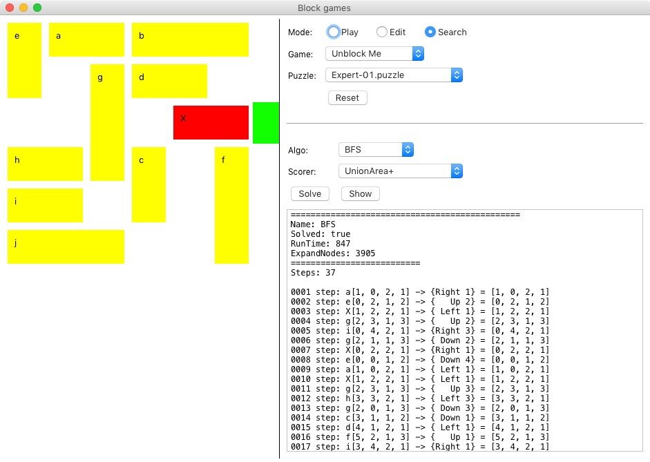

# UnblockmeSearch
A Moving-Block_Game searcher.

# Screenshort(directory-img for more)
Play

Edit

Search


# Features
1. Support steps, status limiting.
2. Support DFS, BFS, A*, DFS+StepIn, IDEA* Algorithm.
3. Support UnblockMe, HuaRongRoad, P9(octet, 八数码) games.
4. Support Manhattan, UnionArea Scorer. 
5. Support (play, edit, auto-search) UI.
    
# TODO
1. Double-BFS for P9(Ending known games).
2. Build Graph for P9(Status Space Known).
3. Puzzle Pre-Judgement.(May have no ans).
    
# Performance(directory-res for more)
    Time:(t-unit: ms)
                   UnblockMe      HuaRongRoad     P9
    DFS            121            418             153
    BFS            269            889             4817
    A*(UA)         86             804             30       ---Use UnionArea Scorer
    DFS+StepIn     1497           16524           5207
    IDEA*          691            10559           9498     ---Use UnionArea Scorer

    Nodes:
                   UnblockMe      HuaRongRoad     P9
    DFS            319            4973            1153
    BFS            869            9747            123695
    A*(UA)         654            9315            482       
    DFS+StepIn     7742           247670          136085
    IDEA*          4318           166563          244490

    Steps:
                   UnblockMe      HuaRongRoad     P9
    DFS            86             1864            642
    BFS            20             55              24
    A*(UA)         25             72              76       
    DFS+StepIn     43             88              26
    IDEA*          20             55              26

# Status space
    UnblockMe:    <    1w        ?
    HuaRongRoad:  <    142560    =    C(12,1)*C(12,5)*C(6,4)
    P9:           =    362880    =    9!
    
# Mark
```
1. 对于华容道，一步可以两个方向，比如L1R1
2. 可以根据空格位置，只有空格周围的方块才能移动，可优化搜索
    a. UnblockMe只有横竖 2 种方向，每个方块最多能移动 4 次
    b. HuaRongRoad只有 1 个空格，1 个状态最多 5 个相邻状态
    c. P9只有 1 个空格，1 个状态最多 2 个相邻状态
```
